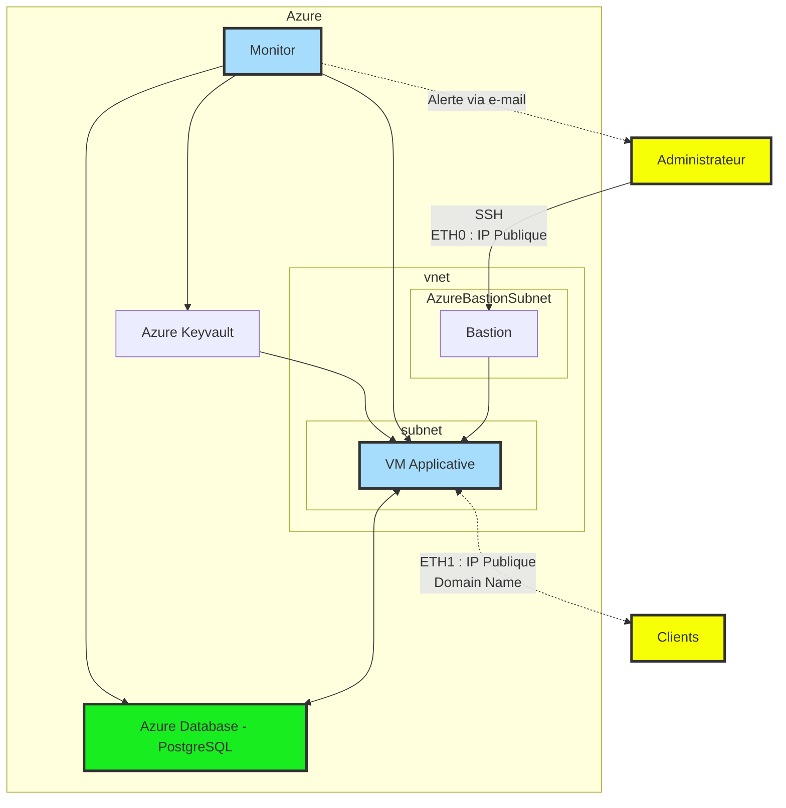

# Brief 4 - Terraform + Ansible + scaling = :exploding_head: 
> Réalisé par : Nicolas, Noa et Thomas
> GitHub : https://github.com/DevSoleo/simplon-brief-4

## Documentation des infrastructures

### Topologie de l’infrastructure

### Liste des ressources Azure
- Azure Key Vault
- "Monitor" sur Azure

| Type | Description |
| -------- | -------- |
| Resource Group | |
| VNet | |
| Subnet | Sous-réseau principal, contient la (ou les) machine(s) virtuellle(s) | |
| Virtual Machine | Premier replica / Premère instance |
| Azure Database | PostgreSQL |
| Network Interface Card | 2 adresses publiques |
| Bastion | Et son sous-réseau AzureBastionSubnet |

### La Stratégie de Scaling

| Utilisation CPU moyenne | Stratégie Scale Out | Stratégie Scale In |
| -------- | ------- | ------ |
| 25% | | Suppression des VM jusqu'à <=1 |
| 70% | Création de +1 VM (total : 2) | |
| 85% | Création de +2 VM (total : 4) | |
| 90% | Envoi d'une alerte par e-mail | |

### Tests et métriques de monitoring

On configure les alertes d'Azure Monitor pour notifier la date d'expiration du certificat TLS quand elle est inférieure à 7 jours et si l'espace de stockage atteint moins de 10% d'espace libre.

### Plan de test de charge
Rédaction d'un script python, qui éxécutera une quantité (définie à l'avance) de requêtes HTTP à destination du serveur n8n. Ces requêtes auront pour objectif la création de comptes utilisateurs sur la plateforme, afin de solliciter la base de données, le réseau, ainsi que la RAM et le CPU.

### La politique de Backup

La politique de backup de la base de donnée à la mise en place d'une backup quotidienne avec une période de rétention de 14 jours. En en conservant une mensuel sur un trimestre puis une semestriel pour une année.

### Liste des tâches
- [ ] Rédiger le script Ansible (déployant l'infrastructure), en y implémentant :
    - [ ] La création des ressources principales (Resource Group, VNet, Subnet, Network Interface Card)
    - [ ] La création du Bastion
    - [ ] L'activation d'Azure Database - PostgresSQL
    - [ ] La création de la VM Applicative
- [ ] Rédiger le script Cloud-Init (déployant le service n8n), en y implémentant :
    - [ ] La création des utilisateurs
    - [ ] L'ajout des clés publiques SSH
    - [ ] L'installation Docker
    - [ ] La création du container n8n
    - [ ] L'installation et l'éxécution de Cerbot
- [ ] Rédiger le script de test de charge en Python